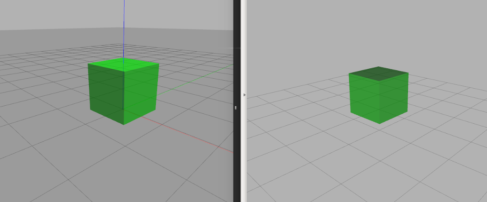
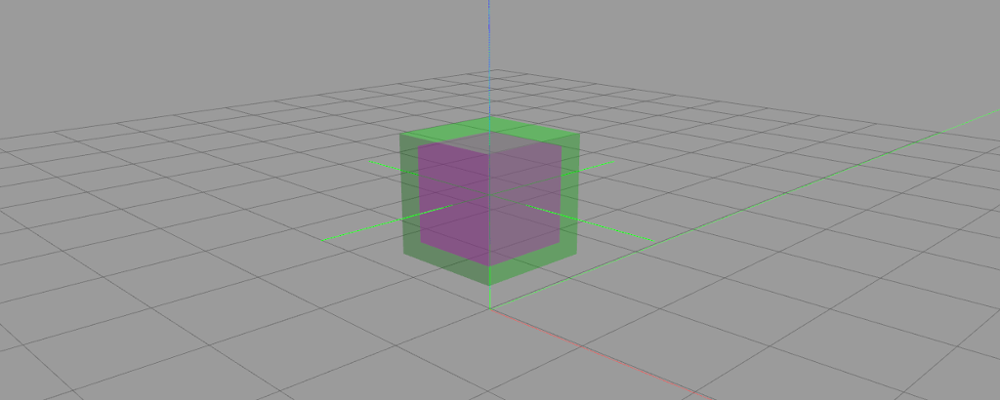

# URDF Juggle package [](https://spdx.org/licenses/MIT.html)

This package contains helpfull Xacro macroses for URDF.
Look in `example` folder for usage examples.

## Colored link
Macros `colored_link` allows to make link with identical visual settings both in rviz and gazebo.
Specify attributes `color` and `transparency` and put tag `visual` inside macros but without tag `material`. Other tags you can put in tag `other`.
```xml
<xacro:colored_link name="box" color="0 0.6 0" transparency="0">
    <visual>
        <geometry>
            <box size="1 1 1" />
        </geometry>
        <origin xyz="0 0 0" rpy="0 0 0" />
    </visual>
    <other>
        <collision>
            ...
        </collision>
        <inertial>
            ...
        </inertial>
        ...
    </other>
</xacro:colored_link>
```


## Inertia
Macroses `box_inertia`, `cylinder_inertia` and `sphere_inertia` contains tag `mass` and appropriate inertia matrix based on mass and geometry.
```xml
<link name="box">
    ...
    <inertial>
        <origin xyz="0 0 0" rpy="0 0 0" />
        <xacro:box_inertia mass="1000" size="0.8 0.8 0.8" />
    </inertial>
    ...
</link>
```
